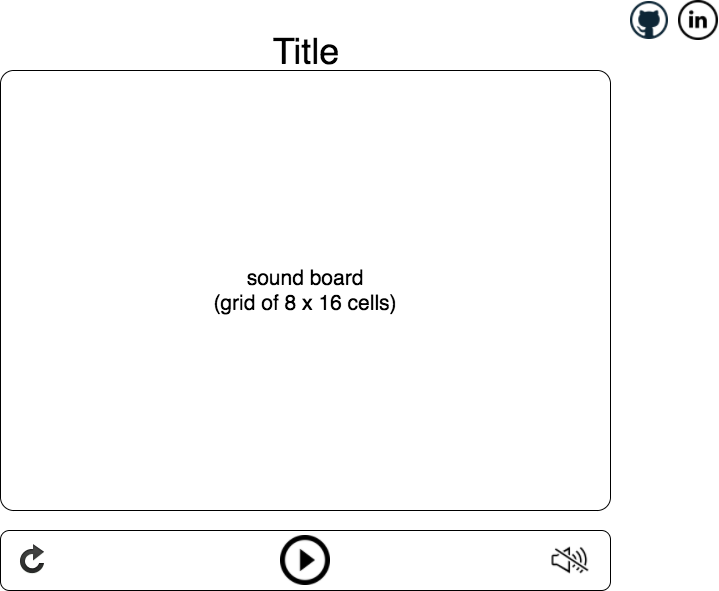

# delabeats

### Background

delabeats is a sound board app created using JavaScript, jQuery, HTML/CSS.

### Functionality & MVP

With delabeats, users will be able to:

- [ ] Start, pause and reset sound board
- [ ] Toggle squares to create or remove sound
- [ ] Option to play or mute beats

### Wireframes

This app will consist of a single screen with a sound board, sound controls. I will have nav links to the project's GitHub repo and my LinkedIn profile.

The sound board will consist of different percussion beats. Each cell on the board will function as an add/remove beat button. The sound controls will include play, mute, reset.

### Architecture and Technologies

This app will be implemented using the following technologies:

* Vanilla JavaScript and jQuery for overall structure
* HTML/CSS for rendering
* Webpack to bundle scripts

There will be 2 main scripts for the functionality of this project:

`board.js` will handle logic for toggling live/dead states of cells

`beats.js` will handle logic for beats

## Implementation Timeline

### Day 1: Project Setup
Setup all necessary Node modules. Create webpack.config.js and package.json. Learn basic Tone.js to play beats.

### Day 2: Learn How to Play Audio
Learn how to create and play sounds. Build out cell objects to fill the board object. Build logic to toggle live/dead states on click of cell.

### Day 3: Create logic to play beats.
Have a functional board and controls to start/play, mute, and stop beats.

### Day 4: User Interface.
Install controls for user interaction. Style sound board and controls.

### Bonus Features

* Record tracks
